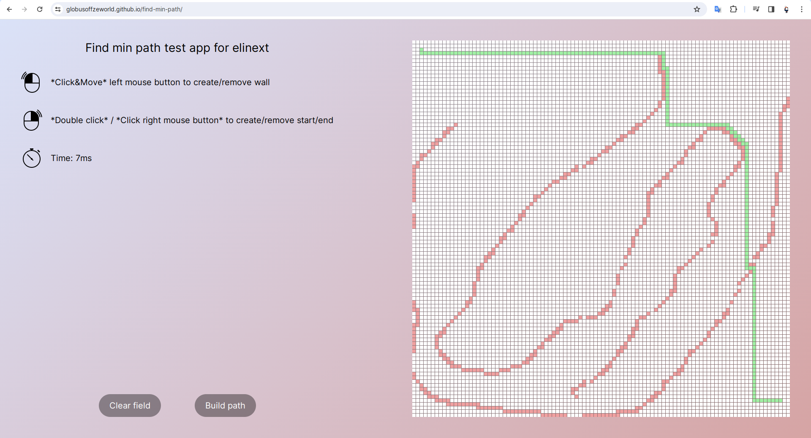
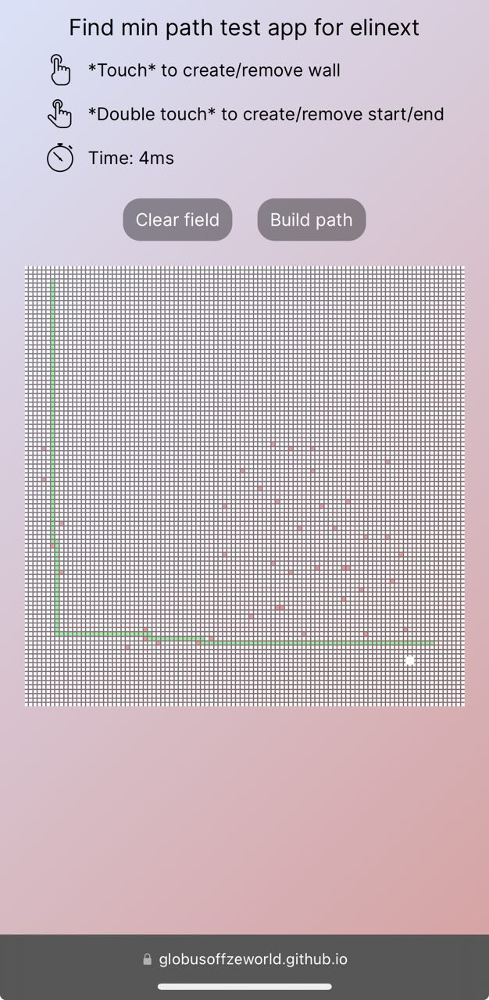

# find-min-path

Приложение для построения кратчайшего пути между
двумя ячейками, с учетом препятствия между ними.

Приложение представляет собой клеточное поле, размером 100 на 100.

Передвижение по ячейкам допустимо только вверх, влево, вниз, вправо. Вне
поля ходить нельзя.

Пользователь должен иметь возможность заблокировать определенные ячейки
на поле (создать препятствие).

Пользователь должен иметь возможность указать стартовую и конечную ячейку.

После нажатия кнопки "построить маршрут", маршрут должен быть построен и
выведено сообщение о времени выполнения построения в ms.

В случае невозможности достигнуть конечной точки, пользователь должен увидеть
сообщение об ошибке.

Пользователь должен иметь возможность сбросить предыдущий расчет и
очистить поле.

## Добавлено
Оптимизация под мобильные устройства и сенсорный экран. 

Добавлены иконки, разные для мобилок и десктопа. 

Настроил конфигурации eslint, pretteier, webpack, tsconfig. 

Добавил алиасы. Добавил анимацию и в целом немножко украсил дизайн.

